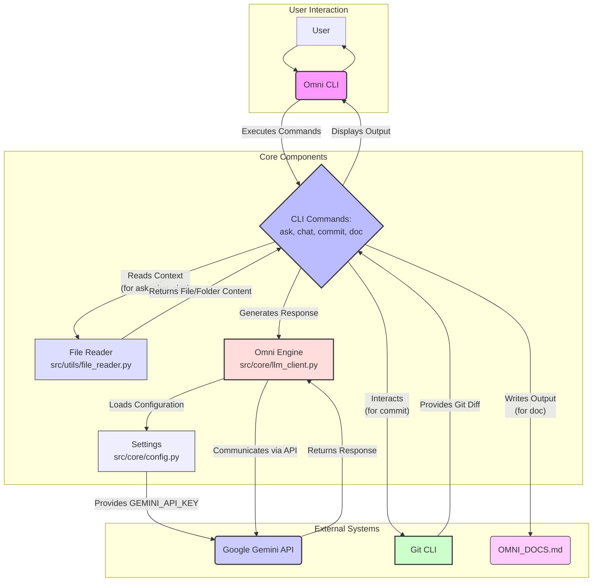

```markdown
# ⚡ Project Omni: Local Agentic CLI

Project Omni adalah sebuah CLI tool berbasis AI yang berfungsi sebagai jembatan otonom (Zero-Cost Local Agent) antara *local codebase* Anda dan *Google Gemini 2.5 Flash API*. Dirancang untuk eliminasi proses *copy-paste* manual ke antarmuka web, alat ini memungkinkan *developer* untuk melakukan "vibe coding" langsung dari terminal, dengan konteks repositori yang utuh.

## 🎯 Fitur Utama

*   **Context-Aware Code Generation:** Mampu membaca struktur direktori dan isi file lokal untuk dijadikan konteks bagi Large Language Model (LLM).
*   **Terminal Native Interaction:** Antarmuka baris perintah yang mulus dan elegan, dibangun menggunakan `Typer` dan `Rich`.
*   **Zero-Cost Operation:** Memanfaatkan Free Tier dari Gemini 2.5 Flash API, memastikan penggunaan tanpa biaya operasional sambil menjaga kualitas dan privasi basis kode.
*   **Auto-Commit Messaging:** Menghasilkan pesan commit yang profesional berdasarkan `git diff` menggunakan konvensi *Conventional Commits*.
*   **Interactive Chat Session:** Sesi obrolan interaktif dengan Gemini yang dapat mengingat percakapan sebelumnya dan memahami konteks codebase awal.
*   **Automated Documentation Generation:** Mampu menghasilkan dokumentasi proyek secara otomatis berdasarkan isi codebase, disimpan dalam format Markdown.

## 🛠️ Tech Stack

*   **Bahasa Pemrograman:** Python 3.11+
*   **LLM Engine:** Google Generative AI (`google-generativeai`) untuk Gemini 2.5 Flash API
*   **CLI Framework:** `Typer`
*   **Terminal UI/Styling:** `Rich`
*   **Environment Variables:** `python-dotenv`
*   **Dependencies:** `click` (sebagai dependensi `Typer`)

## 🚀 Cara Instalasi

Ikuti langkah-langkah berikut untuk menginstal dan menjalankan Project Omni:

1.  **Clone Repository:**
    ```bash
    git clone https://github.com/your-username/omni-agent.git # Sesuaikan dengan repo sebenarnya
    cd omni-agent
    ```

2.  **Buat dan Aktifkan Virtual Environment:**
    ```bash
    python -m venv venv
    source venv/bin/activate  # Untuk Linux/macOS
    # venv\Scripts\activate   # Untuk Windows
    ```

3.  **Instal Dependensi:**
    ```bash
    pip install -r requirements.txt
    ```

4.  **Konfigurasi API Key:**
    *   Buat file `.env` di root project Anda (sejajar dengan `requirements.txt`).
    *   Salin isi dari `.env.example` ke `.env` dan ganti `your_api_key_here` dengan Google Gemini API Key Anda. Anda bisa mendapatkannya dari [Google AI Studio](https://makersuite.google.com/k/api_key).
    ```dotenv
    # .env
    GEMINI_API_KEY=YOUR_API_KEY_HERE # Ganti dengan API Key Anda
    ```
    *   **Penting:** Jangan pernah meng-commit file `.env` ke repository Anda. `.gitignore` sudah dikonfigurasi untuk mengabaikannya.

5.  **Jalankan Omni CLI:**
    Anda dapat menjalankan perintah Omni menggunakan `python -m src.cli.main <command>`.

    ```bash
    python -m src.cli.main --help
    ```

---

## [BAGIAN 2: API DOCS/FUNGSI]

Project Omni adalah sebuah alat CLI, bukan API web. Bagian ini menjelaskan fungsi-fungsi utama yang diekspos melalui perintah CLI.

| Perintah CLI                               | Deskripsi                                                                                                                                                                                                                                       | Argumen / Opsi                                                                                                                                             |
| :----------------------------------------- | :---------------------------------------------------------------------------------------------------------------------------------------------------------------------------------------------------------------------------------------------- | :--------------------------------------------------------------------------------------------------------------------------------------------------------- |
| `omni ask "<prompt>"`                      | Mengirim pertanyaan atau instruksi ke Gemini 2.5 Flash API. Dapat menyertakan konteks dari file atau folder lokal.                                                                                                                               | `--sys`, `-s`: Instruksi sistem / persona AI (default: Senior Software Engineer). <br> `--file`, `-f`: Path ke file atau folder untuk konteks.             |
| `omni chat`                                | Memulai sesi obrolan interaktif dengan Gemini yang mengingat riwayat percakapan. Dapat diinisialisasi dengan konteks file/folder. Ketik `exit` atau `quit` untuk mengakhiri.                                                                      | `--sys`, `-s`: Persona AI (default: Senior Software Engineer). <br> `--file`, `-f`: Path ke file atau folder sebagai konteks awal obrolan.               |
| `omni commit`                              | Menganalisis `git diff` dari perubahan kode lokal (staged atau unstaged) dan menghasilkan satu pesan commit berstandar profesional menggunakan konvensi *Conventional Commits*. Menawarkan konfirmasi untuk commit dan push.               | N/A                                                                                                                                                        |
| `omni doc [path]`                          | Menghasilkan dokumentasi otomatis untuk codebase dari path yang diberikan (file atau direktori) dan menyimpannya ke `OMNI_DOCS.md` di root project. Secara cerdas mengabaikan file biner dan folder yang tidak relevan.                     | `path`: Path direktori atau file codebase yang ingin didokumentasikan (default: direktori saat ini `.` ).                                                  |
| `omni --help` <br> `omni <command> --help` | Menampilkan bantuan umum untuk CLI atau bantuan spesifik untuk suatu perintah.                                                                                                                                                                   | N/A                                                                                                                                                        |

*(Catatan: `omni` adalah alias placeholder. Untuk menjalankan, gunakan `python -m src.cli.main <command>`)*

---

## [BAGIAN 3: MERMAID.JS]

